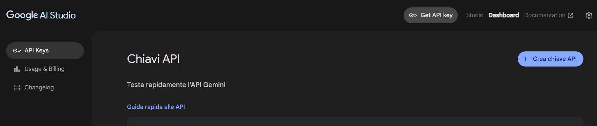
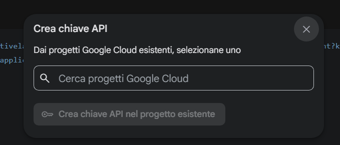
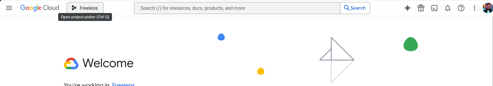
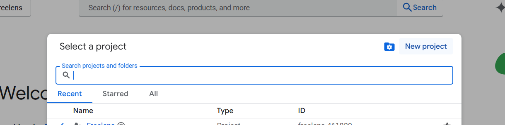
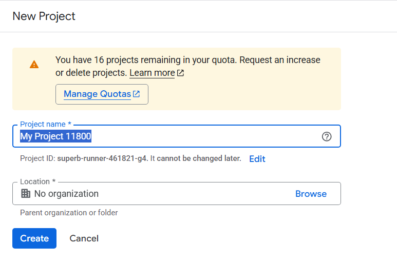
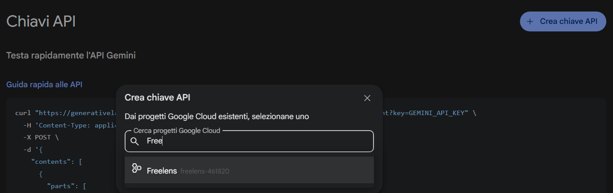

# How to obtain a Google API key to use inside Freelens-ai

Follow the instructions at the link https://ai.google.dev/gemini-api/docs/api-key?hl=it

## Details
To obtain a key you have to access to Google AI Studio with you Google account; from here you can require an API key:

Once you click on the dedicated button, you should bind the API key with one of your GCP projects:

If you don't have any project, access your GCP Platform and create one:

Click on the project button, and it will show you the list of all available projects (if it is you 1st time with GCP you probably don't have any).
From here you can create a new project by clicking on the top right button:
 

Once you are done, go back to Google AI Studio and create the API Key for your just now created project:

Enjoy!
