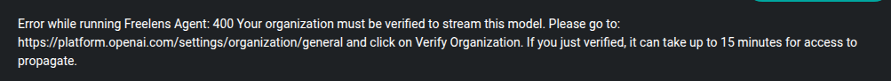
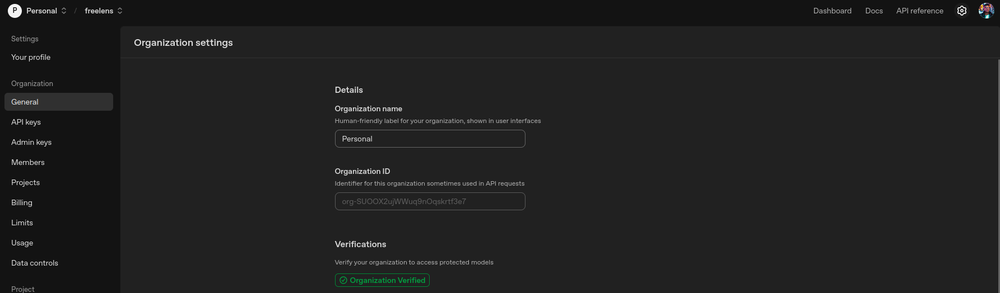

# GPT 5 Set Up
Before use GPT-5 model it is necessary to register your organization on OpenAI API Platform. 

## GPT-5 Error: Organization Registration Required

If you encounter the GPT-5 error (see the image below), it means your organization is not registered or authorized to access GPT-5 through the OpenAI API platform.

### How to Resolve

1. **Go to the [OpenAI API Platform](https://platform.openai.com/settings/organization/general)** and log in with your account.
2. **Register your organization** by going into settings > general and click on organization verify.
3. This will start a process of identification by requesting photos and ID cards.
4. After registration and approval, retry your request in the Freelens AI extension (it can take up to after 15 minutes to propagate changes)

