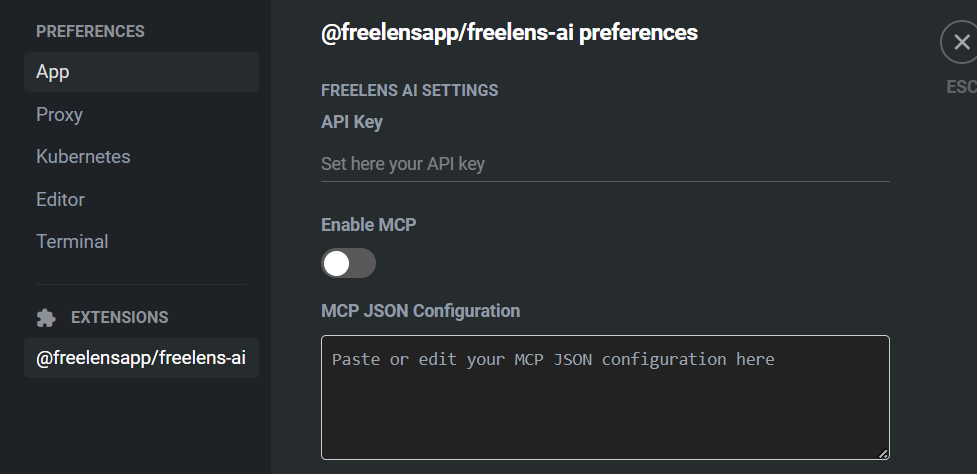
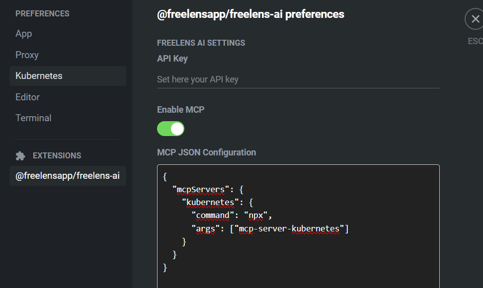

# Setting Up an MCP Agent for Freelens-AI 📡 
This guide will walk you through setting up an MCP (Model Control Protocol) agent to work with Freelens-AI, enabling you to control and interact with AI agents running on your infrastructure.

## Prerequisites
- You have Freelens-AI installed.
- You have Node.js and npx available in your system.

## Configuration
Freelens-AI allows you to configure MCP agents directly from its Preferences page.

1. Open Freelens-AI Preferences
Launch Freelens-AI.
Go to the Preferences page.
Locate the MCP Configuration section.

2. Enable MCP Support
Toggle the Enable MCP Agent option. This enables Freelens-AI to communicate with MCP agents running on your machine or cluster.

3. Add an MCP Server Configuration
Inside the dedicated JSON textarea, add your MCP server configuration. Below is an example configuration for a Kubernetes-based MCP server:

<pre lang="markdown"> <code>
{ 
    "mcpServers": { 
        "kubernetes": { 
            "command": "npx", 
            "args": ["mcp-server-kubernetes"] 
        } 
    } 
} 
</code> </pre>
> ✅ This uses npx to launch the mcp-server-kubernetes module. You can replace this with your own agent command.

🚀 Recommended MCP Agent
For a robust setup, especially in Kubernetes environments, we recommend:
https://github.com/Flux159/mcp-server-kubernetes

🖼️ Screenshots

