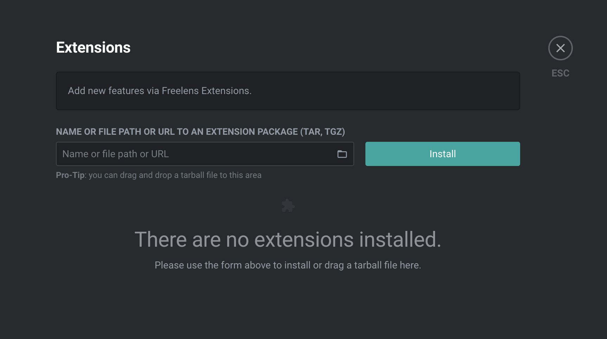
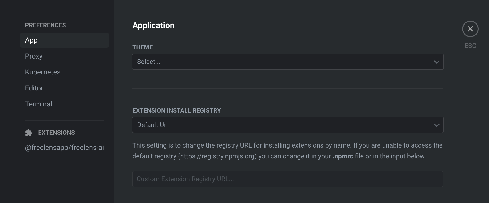
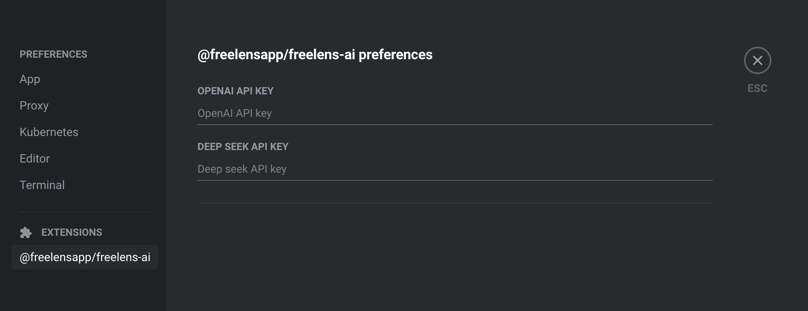

# Set up extension

This guide will help you install the extension in your freelens app.

## Index
- [Set up extension](#set-up-extension)
  - [Index](#index)
    - [Prerequisites](#prerequisites)
    - [Install the extension](#install-the-extension)
    - [Setup API key](#setup-api-key)
      - [Additional Resources](#additional-resources)

### Prerequisites

- Have following the [_**build guide**_](./BUILD.md) in order to create the
  tgz file.
- [_**Freelens**_](https://freelensapp.github.io/)

---

### Install the extension

1. Open Freelens
2. Click on the `Extensions` button in the top right corner

3. Click on the fonder at left of install button

---

### Setup API key

In order to use the extension, you need to set up an API key.

1. Click on the `Preferences` button in the top right corner.

2. Look in `Extenions` section and click on `@freelensapp/freelens-ai`

3. Now you can finaly set you api key

---

#### Additional Resources

- [***README***](../README.md)
- [***Contribute***](CONTRIBUTING.md)
- [***Build freelens-ai extension***](./BUILD.md)

If you find this project useful, please consider giving it a ⭐️ on
[***GitHub***](https://github.com/freelensapp/freelens-ai)!
